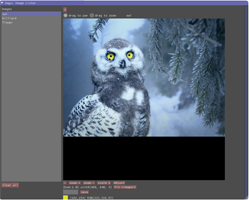
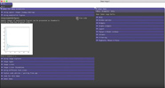

(Py)ImGui for Data Science
===============================================================================

.. image:: https://img.shields.io/pypi/v/imgui_datascience.svg
        :target: https://pypi.python.org/pypi/imgui_datascience

.. image:: https://img.shields.io/travis/pthom/imgui_datascience.svg
        :target: https://travis-ci.org/pthom/imgui_datascience

.. image:: https://readthedocs.org/projects/imgui_datascience/badge/?version=latest
        :target: https://imgui_datascience.readthedocs.io/en/latest/?badge=latest
        :alt: Documentation Status

.. image:: https://pyup.io/repos/github/pthom/imgui_datascience/shield.svg
     :target: https://pyup.io/repos/github/pthom/imgui_datascience/
     :alt: Updates

A set of utilities for data science using python, imgui, numpy and opencv.

* Free software: Apache Software License 2.0
* Documentation: https://imgui_datascience.readthedocs.io.

Features
========

Display numpy.ndarray (aka opencv image)
----------------------------------------
The following types are supported : ``RGB, RGBA, GRAY, float32, float64``

Code::

    # returns mouse_position
    imgui_cv.image(img, height=150, title="flowers")

Display matplotlib figures
--------------------------

    .. image:: images/mplot.jpg
        :height: 200

Code::

    figure = matplotlib.pyplot.figure()
    x = numpy.arange(0.1, 100, 0.1)
    y = numpy.sin(x) / x
    plot.plot(x, y)

    imgui_fig.fig(figure, height=250, title="f(x) = sin(x) / x")

Inspect images
--------------
  * show pixels color (or float values)
  * adjust visibility for float images
  * save images
  * zoom & pan (with possible sync between 2 images)

    .. image:: images/image_explorer.jpg
        :height: 200

See https://www.youtube.com/watch?v=yKw7VaQNFCI&feature=youtu.be for an animated demo.

Code::

    imgui_cv.image_explorer(img)

A simple way to run imgui programs
----------------------------------

The simplest way to run a program a start adding gui buttons is shown below

Code::

    def gui_loop():
        imgui.button("Click me")

    def main():
        imgui_runner.run(gui_loop, imgui_runner.Params())

A simple way to quickly inspect images
--------------------------------------

Below is the simplest to quickly display any type of numpy array (RGB, float, etc) and to be able to inspect it.

Code::

        image = ... # cv2.imread("...")
        ImGuiImageLister.push_image("owl", image)
        ImGuiLister_ShowStandalone()

Full demo
--------

You can run a full demo using either

* Case 1 (from pip install)::

    pip install imgui_datascience
    python -m imgui_datascience --example

* Case 2 (from checkout)::

    python run_example.py

* View the full demo (1'50") on youtube

click on the link below

https://www.youtube.com/watch?v=qstEZyLGsTQ&feature=youtu.be

Credits
=======

This package was created with Cookiecutter_ and the `audreyr/cookiecutter-pypackage`_ project template.

.. _Cookiecutter: https://github.com/audreyr/cookiecutter
.. _`audreyr/cookiecutter-pypackage`: https://github.com/audreyr/cookiecutter-pypackage
